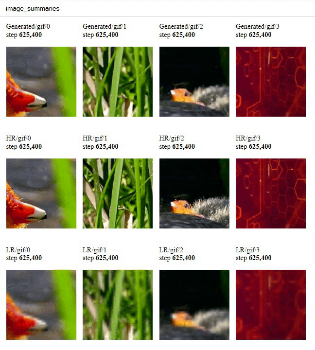

# Super-RES
Bu depo, TecoGAN projesine yönelik kaynak kodunu ve materyalleri, yani video süper çözünürlüğü için Geçici Olarak Tutarlı bir GAN kodunu içerir.
_Yazarlar: Mengyu Chu, You Xie, Laura Leal-Taixe, Nils Thuerey. Münih Teknik Üniversitesi._

### Modeli Çalıştırma

Aşağıda eğitimli bir TecoGAN modelini çalıştırmak için hızlı bir başlangıç kılavuzu bulabilirsiniz.
Parametrelerin daha ayrıntılı açıklamaları için runGan.py dosyasına bakın.
Not: değerlendirme (test durumu 2) şu anda 'CUDA'ya sahip bir Nvidia GPU gerektiriyor.
'tkinter' da gereklidir ve 'python3-tk' paketi aracılığıyla kurulabilir.


```bash
# Install tensorflow1.8+,
pip3 install --ignore-installed --upgrade tensorflow-gpu # or tensorflow
# Install PyTorch (only necessary for the metric evaluations) and other things...
pip3 install -r requirements.txt

# Download our TecoGAN model, the _Vid4_ and _TOS_ scenes shown in our paper and video.
python3 runGan.py 0

# Run the inference mode on the calendar scene.
# You can take a look of the parameter explanations in the runGan.py, feel free to try other scenes!
python3 runGan.py 1 

# Evaluate the results with 4 metrics, PSNR, LPIPS[1], and our temporal metrics tOF and tLP with pytorch.
# Take a look at the paper for more details! 
python3 runGan.py 2

```

### Modeli Eğitin

#### 1. Eğitim Verilerini Hazırlayın

Eğitim ve doğrulama veri seti, aşağıdaki komutlarla seçilen bir 'TrainingDataPath' dizinine indirilebilir. Not: çevrimiçi video indirmek için youtube-dl gerekir.

```bash
# Çevrimiçi video indirmek için youtube-dl'yi yükleyin
pip install --user --upgrade youtube-dl

# önce parametrelere bir göz atın:
python3 dataPrepare.py --help

# Güvenli tarafta olmak için, sadece ne olacağını görmek istiyorsanız aşağıdaki satır hiçbir şey indirmeyecektir,
# Ve bilgileri yalnızca günlük dosyasına kaydedecektir.
# TrainingDataPath hala önemlidir, günlüklerin kaydedildiği dizindir: TrainingDataPath/log/logfile_mmddHHMM.txt
python3 dataPrepare.py --start_id 2000 --duration 120 --disk_path TrainingDataPath --TEST

# Bu, TrainingDataPath altında 28 çevrimiçi videodan her biri 120 kare içeren 308 alt klasör oluşturacaktır.
# Bu uzun zaman alır
python3 dataPrepare.py --start_id 2000 --duration 120 --REMOVE --disk_path TrainingDataPath


```

Hazır olduğunuzda lütfen runGAN.py'deki TrainingDataPath parametresini güncelleyin (durum 3 ve durum 4 için) ve ardından indirilen verilerle eğitime başlayabilirsiniz!

Not: Verilerin çoğu (308 diziden 272'si) yayınlanan modeller için kullandığımız verilerle aynıdır ancak bazıları (308 diziden 36'sı) artık çevrimiçi değildir. Bu nedenle komut dosyası uygun değiştirmeleri indirir.

#### 2. Modeli Eğitin
Bu bölüm yeni bir TecoGAN modelinin eğitilmesi için komut verir. Detaylar ve ek parametreler runGan.py dosyasında bulunabilir. Not: tensorboard gif özeti ffmpeg gerektirir.


```bash
# Install ffmpeg for the  gif summary
sudo apt-get install ffmpeg # or conda install ffmpeg

# Train the TecoGAN model, based on our FRVSR model
# Please check and update the following parameters: 
# - VGGPath, it uses ./model/ by default. The VGG model is ca. 500MB
# - TrainingDataPath (see above)
# - in main.py you can also adjust the output directory of the  testWhileTrain() function if you like (it will write into a train/ sub directory by default)
python3 runGan.py 3

# Train without Dst, (i.e. a FRVSR model)
python3 runGan.py 4

# View log via tensorboard
tensorboard --logdir='ex_TecoGANmm-dd-hh/log' --port=8008

```


### Tensorboard GIF Summary Example
<br>

### Referanslar
[1] [The Unreasonable Effectiveness of Deep Features as a Perceptual Metric (LPIPS)](https://github.com/richzhang/PerceptualSimilarity)  
[2] [Photo-Realistic Single Image Super-Resolution Using a Generative Adversarial Network](https://github.com/brade31919/SRGAN-tensorflow.git)  
[3] [gif_summary](https://colab.research.google.com/drive/1vgD2HML7Cea_z5c3kPBcsHUIxaEVDiIc)
